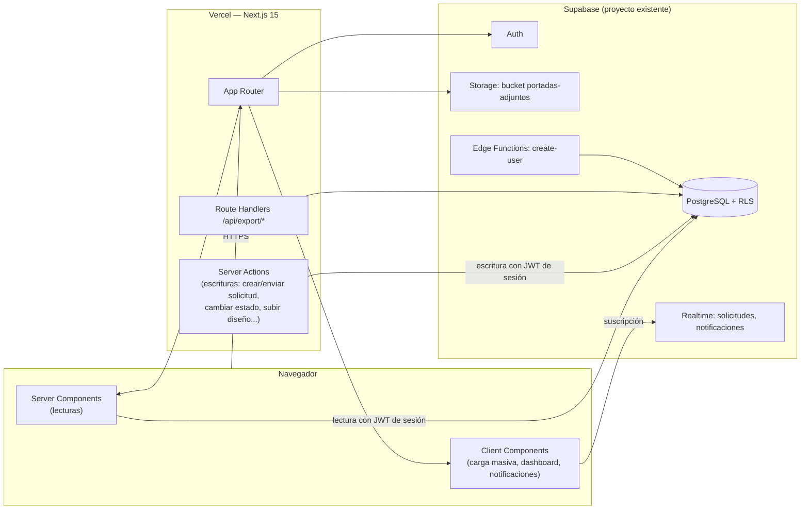
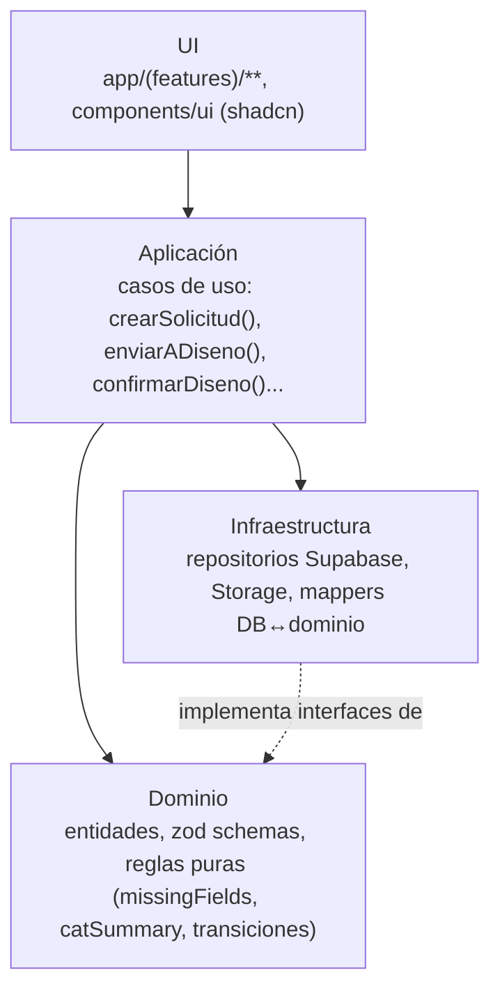

# 2. Arquitectura

## 2.1 Vista de alto nivel

**Decisión clave**: un único repositorio Next.js desplegado en Vercel, conectado al **mismo proyecto Supabase que ya está en producción** — no se crea un backend nuevo ni se migran datos a otro sitio. La diferencia frente a hoy es que **PostgreSQL con RLS pasa a ser la autoridad de seguridad real**, no una promesa implícita: hoy un `if (rol === 'admin')` en el JS decide qué botón se muestra, pero nada impide (verificado o no) que una llamada directa a la REST API con la clave pública salte esa comprobación si las policies no están bien cerradas. Tras la migración, la misma consulta falla en la base de datos si el usuario no tiene permiso, venga de donde venga.

## 2.2 Principios arquitectónicos

1. **La regla de dependencia va hacia adentro**: UI → Aplicación → Dominio. Dominio no importa nada de Next.js, Supabase ni React.
2. **RLS es la fuente de verdad de seguridad**, no un cinturón extra. La lógica de "comercial ve solo lo suyo", "responsable ve su canal", "diseño ve lo asignado o todo si es responsable" se implementa como políticas SQL, no como filtros en el cliente.
3. **Server Components por defecto.** Listados de solicitudes, campañas, usuarios y el panel global se leen server-side. Un componente es Client solo si necesita interactividad puntual (carga masiva con preview, dashboard con Chart.js, badge de notificaciones en vivo, autocompletado de menciones).
4. **Server Actions para toda escritura del propio dominio.** No se crea una API REST propia para el CRUD interno: crear solicitud, cambiar de estado, asignar diseñador, subir adjunto, confirmar/archivar son Server Actions.
5. **React Query solo donde aporta valor real** (ver 2.5).
6. **Nada de datos de auditoría sobrescritos.** `logs` es append-only a nivel de base de datos (permisos revocados de `UPDATE`/`DELETE`), no solo por convención de la UI — igual que hoy funciona de facto, pero garantizado.

## 2.3 Capas

- **UI**: páginas (Server Components), tablas y formularios (`react-hook-form` + `zod`, mismo schema que el dominio). No decide permisos — los invoca y confía en que la base de datos los hará cumplir.
- **Dominio**: tipos y validaciones de Solicitud, SolicitudCatalogo, Campaña, Perfil; reglas puras portadas del código actual sin tocar la base de datos: `missingFields(solicitud)` (campos obligatorios pendientes por catálogo activo), `catSummary(solicitud, catalogo)` (resumen visual de una celda de catálogo), `puedeTransicionarA(estadoActual, estadoNuevo, rol)` (la máquina de estados de la sección 3 de `05-flujo-navegacion.md`), `parseCargaFilename(nombre)` (parseo de convención de nombre para carga masiva).
- **Aplicación**: casos de uso (`crearSolicitud`, `enviarADiseno`, `asignarDisenador`, `marcarDisenoListo`, `confirmarDiseno`, `solicitarModificacion`, `archivarSolicitud`, `procesarCargaMasiva`, `crearCampana`, `crearUsuario`) como Server Actions finas que orquestan dominio + infraestructura, y que registran el evento en `logs` como parte de la misma transacción — no como un paso aparte que el código de aplicación pueda olvidar.
- **Infraestructura**: repositorios que hablan con Supabase con el cliente server-side (JWT del usuario, nunca `service_role` en código que responde a una petición de usuario), adaptador de Storage, mappers de filas de PostgreSQL a tipos de dominio.

## 2.4 Next.js 15: qué va en cada sitio

| Necesidad | Mecanismo | Ejemplo |
|---|---|---|
| Mostrar datos | Server Component + fetch directo al repositorio | Listado de solicitudes, panel global, ficha de campaña |
| Guardar/mutar datos | Server Action | Crear solicitud, cambiar estado, asignar diseñador, confirmar diseño |
| Subida de archivos con preview/progreso | Client Component + Server Action de commit | Logo del cliente, diseño final, carga masiva |
| Carga masiva con matching automático | Client Component con estado local optimista (preview ✅/❌/⚠️ antes de confirmar) | Emparejar N archivos con N solicitudes por SAP+catálogo |
| Dashboard con gráficos | Client Component + Chart.js (se mantiene la librería actual) | Los 7 gráficos ya existentes |
| Autocompletado de menciones en comentarios | Client Component con estado local | `@` + búsqueda entre `perfiles` activos |
| Contador de notificaciones que debe sentirse "vivo" | Client Component + Supabase Realtime | Badge de no leídas en el header |
| Exportar Excel | Route Handler que genera el `.xlsx` server-side con `exceljs` | Exportación del panel global por campaña |
| Importar Excel | Client Component (parseo con `xlsx` en el navegador para preview) → Server Action (inserta/actualiza validado) | Importación masiva de solicitudes |
| Tarea programada | Supabase Edge Function + `pg_cron` (si se activa email, ver pregunta abierta) | Recordatorio de campaña próxima a cerrar |

## 2.5 Cuándo sí usar React Query (y cuándo no)

**Sí**:
- **Carga masiva de diseños**: preview de matches contra las solicitudes antes de confirmar, con posibilidad de corregir sin recargar.
- **Notificaciones**: contador y panel en vivo combinados con Supabase Realtime.
- **Autocompletado de menciones**: evita refetch redundante de `perfiles` entre formularios.

**No** (Server Components + `revalidatePath` tras el Server Action ya resuelven el caso):
- Listados de Solicitudes, Campañas, Usuarios, Panel global, Dashboard.

## 2.6 Supabase: estrategia por servicio

- **Auth**: email/password + recuperación de contraseña (ya existente, se conserva). El rol y canal **no** se guardan en `app_metadata` del JWT — se resuelven en cada consulta contra `perfiles`, que es lo que las políticas RLS consultan. Esto es exactamente el comportamiento actual (el rol vive en una tabla, no en el JWT); lo que cambia es que la comprobación pasa de vivir solo en el JS a estar garantizada por RLS.
- **RLS**: activada en todas las tablas de dominio. Patrón: `comercial` ve/edita solo sus propias solicitudes; `responsable_comercial` ve/edita las de su canal; `disenador` ve/edita las que tiene asignadas (o sin asignar, para autoasignarse) en estados de diseño; `responsable_diseno` ve/edita todas las de diseño; `admin`/`marketing` ven/editan todo. Detalle completo en `03-modelo-datos.md`.
- **Storage**: se mantiene el bucket `portadas-adjuntos`, con políticas de Storage que replican la misma lógica de acceso que RLS en PostgreSQL (hoy la URL pública basta porque no hay política real; tras la migración el acceso se acota por solicitud/rol).
- **Realtime**: activado sobre `solicitudes` y `notificaciones`, igual que hoy — pero consumido con `supabase-js` en el cliente en vez del WebSocket Phoenix manual actual, con el mismo *fallback* a polling si la suscripción falla.
- **Edge Functions**: se conserva `create-user` (alta de usuario con Service Role Key). Se añade una función de recordatorios/nightly-digest solo si la pregunta abierta de email se resuelve que sí.

## 2.7 Seguridad y auditoría

- Principio de menor privilegio: el cliente Supabase usado en Server Components/Actions siempre lleva el JWT del usuario; la `service_role` key solo se usa en la Edge Function `create-user`, nunca expuesta a código que responde a una petición de usuario normal.
- `logs` (ya existente) se refuerza como append-only real a nivel de base de datos (`revoke update, delete`), y sigue sirviendo doble propósito: historial de auditoría y feed de comentarios/menciones, igual que hoy.
- El bucket de Storage deja de servir todo con URL pública sin control: las políticas de Storage exigen que quien lee/escribe un archivo de una solicitud tenga acceso a esa solicitud según las mismas reglas de RLS.

## 2.8 Calidad y despliegue

- **Testing**: unitario sobre las reglas de dominio migradas (`missingFields`, `catSummary`, `parseCargaFilename`, la máquina de estados), integración de los repositorios contra una base Supabase local (`supabase start`), end-to-end (Playwright) sobre el flujo crítico: crear solicitud → enviarla → pasar por diseño → confirmar.
- **CI/CD**: GitHub Actions ejecuta lint + typecheck + tests en cada PR; Vercel genera preview deployment automático por PR; merge a `main` despliega a producción.
- **Migraciones**: gestionadas con Supabase CLI (`supabase/migrations`), versionadas en el repo — pero **partiendo del esquema real ya existente** (`supabase db pull` como primer paso de la Fase 0, ver `03-modelo-datos.md` § 3.1), no de un esquema vacío.
