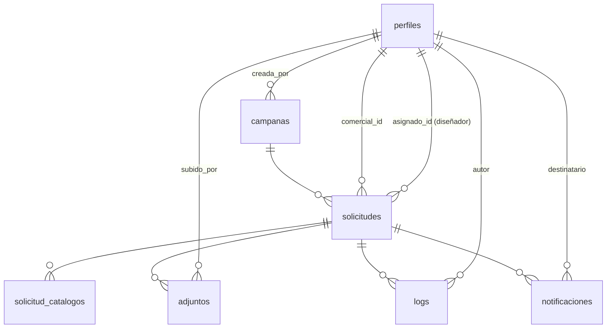

# 3. Modelo de datos

> Por el principio inamovible (`00-resumen-ejecutivo.md`), este documento describe el esquema **tal como existe hoy** en producción, con un único añadido: políticas RLS. No se introduce ningún tipo `enum`, tabla nueva ni columna nueva que no sea estrictamente necesaria para que Next.js pueda leer/escribir exactamente lo mismo que `index.html` lee/escribe hoy. Todo lo que en un diseño anterior de este documento proponía normalizar el esquema (roles, canal, documentos de campaña, lectura de notificaciones) se ha movido a `07-propuestas-futuras.md`.

## 3.1 Punto de partida: esto ya existe en producción

Antes de escribir la primera migración de la Fase 0 (método vigente — ver decisión de la Fase 0 de priorizar Dashboard sobre CLI, `00-resumen-ejecutivo.md` § "Principio de trabajo"):

1. Consultas de **solo lectura** en el **SQL Editor** del Dashboard del proyecto de producción (`paqtohmxagfebeyyurlq.supabase.co`) contra `information_schema` y `pg_policies` para obtener el esquema efectivo exacto: columnas y tipos reales, constraints existentes, y si ya hay alguna policy RLS parcial. Sin CLI, sin conexión directa a Postgres desde ninguna máquina — solo el navegador. (Se descartó explícitamente `supabase db pull`/`pg_dump`: exigían herramientas locales sin aportar ninguna garantía de seguridad adicional frente al SQL Editor para este caso.)
2. Aplicar ese mismo esquema (DDL) al **proyecto Supabase de desarrollo** (`portadas-personalizadas-dev`, Reference ID `xjyftgvyzyzmccobynzt`) pegando el SQL correspondiente en **su propio** SQL Editor. Todo lo que sigue en este documento (RLS, policies) se desarrolla y verifica contra ese proyecto de desarrollo, nunca directamente contra producción.
3. Confirmar contra el resultado de esas consultas los tipos de columna que aquí se describen como "a confirmar" (marcados explícitamente más abajo) — este documento se basa en el comportamiento observado en `index.html`, no en una inspección directa del esquema SQL.
4. Ninguna migración de esta fase hace `DROP TABLE`, `TRUNCATE`, ni renombra/retipa columnas con datos. Las únicas migraciones previstas son: `ALTER TABLE ... ENABLE ROW LEVEL SECURITY` y `CREATE POLICY`.
5. Estas migraciones se aplican contra el proyecto de **producción** únicamente como parte del Cutover (`06-roadmap.md`), pegadas en su SQL Editor, nunca antes — y solo tras haber sido validadas por completo contra el proyecto de desarrollo durante las Fases 0-5.
6. Cada SQL ejecutado en cualquiera de los dos SQL Editor se guarda también como archivo en `webapp/supabase/migrations/` (subido vía GitHub) para mantener el historial versionado en el repositorio — no depende de la CLI para existir, solo de copiar el SQL ya ejecutado.

## 3.2 Diagrama entidad-relación (sin cambios respecto al actual)



## 3.3 Qué cambia y qué no

| | Cambia en esta migración | No cambia (documentado en `07-propuestas-futuras.md` si aplica) |
|---|---|---|
| Permisos | Se eliminan las políticas `allow_all` existentes en las 7 tablas y se activan políticas reales replicando cada `if (rol === ...)` del JS actual (ver § 3.4.1 — RLS ya estaba "activada" pero neutralizada) | Qué ve cada rol — idéntico a hoy |
| Roles | — | `perfiles.rol` ya es un enum real (`rol_usuario`) en producción, con los mismos valores legacy documentados (`comercial_nacional`, `comercial_exportacion`, etc.) — no hay que crear el tipo, ya existe |
| Campañas | — | `covers`/`covers_instrucciones` siguen siendo JSON en la propia fila de `campanas` |
| Notificaciones | — | Sin columna `read_at`; estado de lectura sigue en `localStorage` del navegador |
| Logs | — | Sin `REVOKE UPDATE/DELETE` (aunque técnicamente no cambiaría comportamiento visible, no es estrictamente necesario para la migración — ver `07-propuestas-futuras.md` § 6 sobre el criterio usado) |
| Storage | — | Bucket `portadas-adjuntos` sigue con URLs públicas, sin políticas de acceso nuevas (pregunta abierta en `00-resumen-ejecutivo.md`) |

## 3.4 Tablas tal como existen — verificado contra producción el 2026-07-31

Esquema real, obtenido por consulta directa (SQL Editor, solo lectura) contra el proyecto de producción. Sustituye por completo la versión anterior de esta sección, que eran suposiciones basadas en `index.html` — varias resultaron incorrectas, ver el detalle marcado con **← real** en cada diferencia.

```sql
-- perfiles: "rol" ES un enum real (rol_usuario), no texto libre como se asumía.
-- Valores confirmados (10, coinciden exactamente con los documentados en 01-analisis-funcional.md):
--   admin, marketing, comercial, comercial_nacional, comercial_exportacion,
--   responsable, responsable_nacional, responsable_exportacion,
--   disenador, responsable_diseno
create table perfiles (
    id uuid primary key references auth.users(id),
    nombre text not null,
    email text not null,              -- ← real: SIN unique a nivel de BD (se asumía única)
    rol rol_usuario not null default 'comercial',  -- ← real: ENUM, no texto libre
    codigo text,                       -- ← real: nullable, SIN unique (se asumía not null)
    activo boolean not null default true,
    created_at timestamptz not null default now(),
    notif_preferencia text default 'ambas'  -- ← real: columna no documentada hasta ahora (ambas/email/herramienta/ninguna, ver NOT-11/NOT-12 de la matriz)
    -- sin columna "canal": el canal sigue incrustado en el valor de "rol", confirmado
);

create table campanas (
    id uuid primary key default uuid_generate_v4(),  -- ← real: uuid_generate_v4(), no gen_random_uuid()
    nombre text not null,
    descripcion text,
    fecha_cierre date,                 -- ← real: nullable (se asumía not null)
    activa boolean not null default true,
    created_at timestamptz not null default now(),
    catalogos jsonb default '["roly", "roly_wrk", "stamina"]'::jsonb,  -- ← real: JSONB, no array de texto; el default no incluye "xmas" (solo afecta a campañas nuevas sin especificar)
    covers jsonb default '{}'::jsonb,
    covers_instrucciones jsonb default '{}'::jsonb
    -- confirmado: NO existen updated_at ni creada_por
);

create table solicitudes (
    id uuid primary key default uuid_generate_v4(),
    campana_id uuid references campanas(id),      -- ← real: nullable (se asumía not null)
    comercial_id uuid references perfiles(id),      -- ← real: nullable (se asumía not null)
    asignado_id uuid references perfiles(id),
    cod_sap text not null,
    nombre_empresa text,                             -- ← real: nullable (se asumía not null)
    provincia text,
    estado estado_solicitud not null default 'borrador',  -- ← real: ENUM, no texto libre — ver hallazgo del valor "diseno_en_revision" más abajo
    comentarios text,
    created_at timestamptz not null default now(),
    updated_at timestamptz not null default now(),
    enviada_at timestamptz,
    confirmada_at timestamptz,          -- ← real: columna no documentada hasta ahora
    idioma text,                         -- ← real: nullable (se asumía not null)
    canal text                           -- ← real: nullable (se asumía not null)
    -- confirmado: NO existe constraint unique(campana_id, cod_sap) a nivel de BD —
    -- la comprobación de duplicados de SOL-11 es puramente del cliente (index.html), no de la base de datos
);

create table solicitud_catalogos (
    id uuid primary key default uuid_generate_v4(),
    solicitud_id uuid not null references solicitudes(id),
    catalogo text not null,
    catalogo_digital boolean,
    catalogo_impreso boolean,
    portada_personalizada boolean,
    portada_opcion_1 text,
    portada_opcion_2 text,
    portada_opcion_3 text,
    portada_diseno_propio boolean default false,
    posicion_logo text,
    unidades int,
    diseno_url text,        -- ← real: columna no documentada hasta ahora
    diseno_at timestamptz,  -- ← real: columna no documentada hasta ahora
    portada_elegida text,
    con_precios boolean,
    unique (solicitud_id, catalogo)  -- confirmado que existe, tal como se había documentado
);

create table adjuntos (
    id uuid primary key default uuid_generate_v4(),
    solicitud_id uuid not null references solicitudes(id),
    nombre text not null,
    tipo text not null,
    url text not null,
    subido_por uuid references perfiles(id),  -- ← real: nullable (se asumía not null)
    subido_por_nombre text,                    -- ← real: columna no documentada hasta ahora (snapshot del nombre)
    created_at timestamptz not null default now(),
    catalogo text
);

create table logs (
    id uuid primary key default uuid_generate_v4(),
    solicitud_id uuid references solicitudes(id),  -- ← real: nullable (se asumía not null)
    usuario_id uuid references perfiles(id),
    usuario_nombre text,
    accion text not null,
    detalle jsonb,
    created_at timestamptz not null default now()
);

create table notificaciones (
    id uuid primary key default uuid_generate_v4(),
    solicitud_id uuid references solicitudes(id),  -- ← real: nullable (se asumía not null)
    destinatario text not null,
    asunto text not null,
    cuerpo text not null,
    enviado boolean not null default false,
    enviado_at timestamptz,   -- ← real: columna no documentada hasta ahora
    created_at timestamptz not null default now()
    -- confirmado: sin read_at, el estado de lectura sigue en localStorage
);
```

Nota sobre `notificaciones.destinatario`: confirmado, sigue siendo un email en texto libre, no una FK a `perfiles`. Se mantiene así por lo mismo que ya se explicaba aquí: no es necesario para que RLS funcione, queda en `07-propuestas-futuras.md` si se decide limpiar.

### 3.4.1 Hallazgo crítico: RLS ya existe en producción — pero neutralizada

La premisa de partida de este documento ("hoy no hay RLS en producción, todo lo hace el JS") **era incorrecta en la forma técnica, aunque correcta en el efecto práctico**. La consulta real muestra:

- Las 7 tablas tienen `RLS habilitada` (`rowsecurity = true`).
- Cada una de las 7 tiene una política llamada `allow_all`: `USING (true)`, `WITH CHECK (true)`, aplicable a todos los comandos (`ALL`).
- `solicitudes` tiene además una segunda política, `comercial_solo_sus_solicitudes`, con una condición real y razonable (`rol <> 'comercial' OR comercial_id = auth.uid()`).

En PostgreSQL, las políticas permisivas (el tipo por defecto, y no hay ninguna marcada como `RESTRICTIVE` aquí) se combinan con **OR**. Como `allow_all` es literalmente `true`, el resultado de `true OR <cualquier otra condición>` es siempre `true` — **`comercial_solo_sus_solicitudes` no está teniendo ningún efecto real**, y las 7 tablas están, en la práctica, completamente abiertas a nivel de base de datos, igual que si RLS no existiera. Esto confirma (por una vía distinta a la que asumíamos) que la única protección real hoy es la de `index.html` en el cliente.

Hipótesis razonable, no confirmada: alguien empezó a implementar RLS de verdad (`comercial_solo_sus_solicitudes`), esa política por sí sola rompía el acceso de admin/marketing/diseño/responsables (no los menciona), y se añadió `allow_all` como parche para no bloquear la aplicación, sin volver a completar el diseño.

**Consecuencia para el Paso 4 y para `03-modelo-datos.md` § 3.5**: nuestra migración de RLS no puede limitarse a añadir políticas nuevas — tiene que **eliminar explícitamente las políticas `allow_all`** de las 7 tablas, o las políticas restrictivas que preparamos quedarán igual de neutralizadas. Pendiente de decidir qué hacer con `comercial_solo_sus_solicitudes`: sustituirla por nuestra `solicitudes_select`/`solicitudes_update` (que cubre los mismos casos y además el resto de roles), o conservarla y completarla. La sección § 3.5 se actualiza en el siguiente paso, una vez resuelto el hallazgo de la siguiente sección.

### 3.4.2 Hallazgo a verificar: un valor de estado no documentado

El enum `estado_solicitud` tiene **9 valores**, no 8:

`borrador`, `enviada`, `en_revision_marketing`, `en_diseno`, **`diseno_en_revision`**, `modificar_diseno`, `confirmada`, `diseno_en_revision_comercial`, `archivada`.

`diseno_en_revision` (sin el sufijo `_comercial`) no aparece en ninguno de los análisis previos de `index.html` (`01-analisis-funcional.md`, `05-flujo-navegacion.md`, `09-matriz-paridad-funcional.md` EST-01) — toda la máquina de estados documentada usa `diseno_en_revision_comercial`. Por el principio de "no replicar bugs a ciegas" (`00-resumen-ejecutivo.md`), no se puede asumir ni que es un valor vivo que falta documentar, ni que es un resto histórico sin uso — hace falta comprobarlo antes de decidir cómo tratarlo en las políticas RLS del disenador (que filtran explícitamente por lista de estados). Ver la consulta de verificación al final de esta sección.

## 3.5 RLS objetivo — contra el esquema exactamente como es

> **Pendiente de actualizar.** Esta sección todavía no incorpora los dos hallazgos de § 3.4.1 y § 3.4.2: (a) hay que añadir `DROP POLICY allow_all` en las 7 tablas antes de crear las políticas de abajo, y (b) la lista de estados visibles para `disenador`/`responsable_diseno` puede necesitar incluir `diseno_en_revision` si resulta ser un estado en uso real — pendiente de la consulta de verificación de § 3.4.2. No aplicar este SQL a ningún proyecto hasta resolver ambos puntos.

```sql
create or replace function rol_actual()
returns text
language sql stable security definer as $$
    select rol from perfiles where id = auth.uid()
$$;

create or replace function email_actual()
returns text
language sql stable security definer as $$
    select email from perfiles where id = auth.uid()
$$;
```

**Solicitudes** — cada condición es literalmente la misma que hoy decide una fila visible en `renderComercialTable`/`renderDisenoTable`, incluidas las variantes legacy de rol:

```sql
alter table solicitudes enable row level security;

create policy solicitudes_select on solicitudes for select
using (
    rol_actual() in ('admin', 'marketing')
    or comercial_id = auth.uid()
    or (rol_actual() = 'responsable_nacional' and canal = 'nacional')
    or (rol_actual() = 'responsable_exportacion' and canal = 'exportacion')
    or rol_actual() = 'responsable' -- legacy genérico: mismo comportamiento que hoy, a confirmar contra el código si ve todo o nada
    or (
        rol_actual() in ('disenador', 'responsable_diseno')
        and estado in ('en_diseno', 'modificar_diseno', 'diseno_en_revision_comercial', 'confirmada')
    )
);

create policy solicitudes_insert on solicitudes for insert
with check (
    rol_actual() in ('admin', 'marketing', 'comercial_nacional', 'comercial_exportacion', 'comercial',
                      'responsable_nacional', 'responsable_exportacion', 'responsable')
);

create policy solicitudes_update on solicitudes for update
using (
    rol_actual() in ('admin', 'marketing')
    or comercial_id = auth.uid()
    or (rol_actual() = 'responsable_nacional' and canal = 'nacional')
    or (rol_actual() = 'responsable_exportacion' and canal = 'exportacion')
    or (rol_actual() in ('disenador', 'responsable_diseno') and estado in ('en_diseno', 'modificar_diseno'))
);
```

> **Nota de verificación obligatoria**: la condición para el rol legacy `responsable` (sin canal explícito) no se pudo determinar con certeza solo leyendo `index.html` — antes de activar esta policy en producción, verificar contra el código actual (o contra un usuario de prueba con ese rol) si ve todas las solicitudes, ninguna, o si ese valor de rol ya no está en uso. Esto es exactamente el tipo de comprobación que exige el principio de paridad: no se puede "decidir" el comportamiento de un rol legacy, hay que confirmarlo.

`solicitud_catalogos`, `adjuntos` y `logs` heredan la visibilidad de su `solicitud_id` con el mismo patrón (`exists (select 1 from solicitudes s where s.id = solicitud_id and <condición de arriba>)`).

**Notificaciones** — filtradas por email, igual que hoy:

```sql
alter table notificaciones enable row level security;

create policy notificaciones_select on notificaciones for select
using (destinatario = email_actual());
```

**Campañas y usuarios**: lectura abierta a cualquier autenticado (igual que hoy, todos necesitan ver campañas activas); escritura solo `admin`/`marketing`:

```sql
alter table campanas enable row level security;
create policy campanas_select on campanas for select using (true);
create policy campanas_write on campanas for insert with check (rol_actual() in ('admin', 'marketing'));
create policy campanas_update on campanas for update using (rol_actual() in ('admin', 'marketing'));
```

## 3.6 Storage

El bucket `portadas-adjuntos` mantiene sus URLs públicas actuales — no se añaden políticas de Storage en esta migración (pregunta abierta 2 de `00-resumen-ejecutivo.md`). Añadir RLS a las tablas de PostgreSQL no cambia nada sobre Storage: son sistemas de permisos independientes en Supabase.

## 3.7 Todo lo demás

Cualquier mejora de esquema identificada durante este diseño (roles normalizados, `read_at`, tabla de documentos de campaña, FK de notificaciones, políticas de Storage) está en `07-propuestas-futuras.md`, explícitamente fuera de esta migración.
