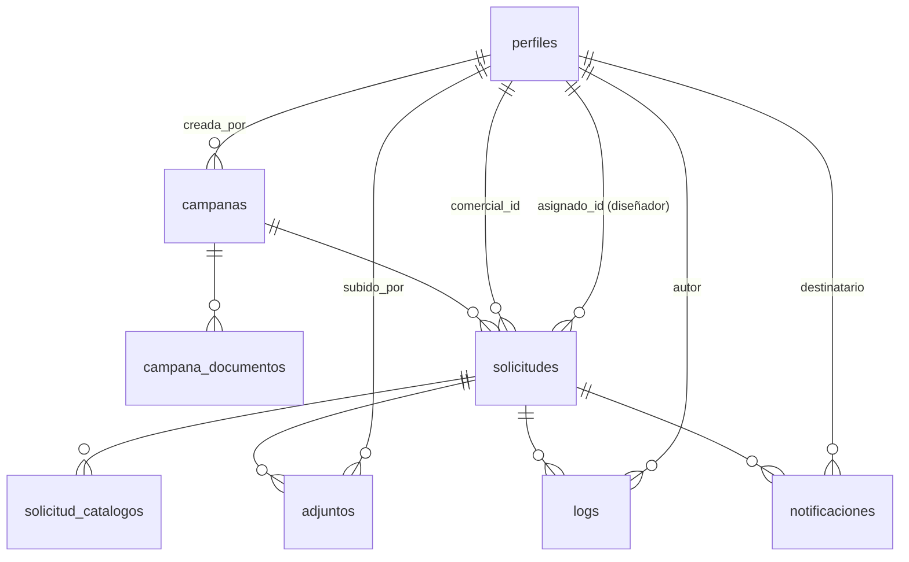

# 3. Modelo de datos

## 3.1 Punto de partida: esto ya existe en producción

Este esquema **no se crea desde cero**. El proyecto Supabase `paqtohmxagfebeyyurlq.supabase.co` ya tiene, con datos reales, las tablas `perfiles`, `campanas`, `solicitudes`, `solicitud_catalogos`, `logs`, `notificaciones` y `adjuntos`, y el bucket de Storage `portadas-adjuntos`. Antes de escribir la primera migración de la Fase 0:

1. `supabase db pull` contra el proyecto real para obtener el esquema efectivo (tipos de columna exactos, constraints y policies RLS que puedan existir hoy, aunque sea de forma parcial).
2. Comparar ese esquema con el descrito aquí y decidir, columna por columna, si el cambio es un `ALTER TABLE` (añadir constraint, índice, columna nueva) o requiere una migración de datos (por ejemplo, la normalización de roles legacy de la sección 3.3, o mover `covers`/`covers_instrucciones` de JSON a tabla en 3.4).
3. Ninguna migración de esta fase hace `DROP TABLE` ni `TRUNCATE` sobre tablas con datos — solo aditivas o de transformación con backfill explícito.

Lo que sigue es el esquema **objetivo**, para guiar esas migraciones incrementales.

## 3.2 Diagrama entidad-relación



## 3.3 Tipos enumerados

```sql
create type rol_usuario as enum (
    'admin', 'marketing', 'comercial', 'responsable_comercial', 'disenador', 'responsable_diseno'
);
create type canal_comercial as enum ('nacional', 'exportacion');
create type catalogo_key as enum ('roly', 'roly_wrk', 'stamina', 'xmas');
create type estado_solicitud as enum (
    'borrador', 'enviada', 'en_revision_marketing', 'en_diseno',
    'modificar_diseno', 'diseno_en_revision_comercial', 'confirmada', 'archivada'
);
create type posicion_logo as enum ('A', 'B', 'C');
create type tipo_documento_campana as enum ('cover', 'instrucciones');
create type tipo_adjunto as enum ('logo_general', 'diseno_portada', 'modificacion');
create type accion_log as enum ('creacion', 'edicion', 'adjunto', 'asignacion', 'comentario', 'cambio_estado');
create type tipo_notificacion as enum (
    'solicitud_devuelta', 'solicitud_en_revision', 'solicitud_en_diseno',
    'diseno_listo', 'modificacion_solicitada', 'solicitud_confirmada', 'mencion'
);
```

**Migración de roles legacy** (sección 1.3/1.6 de `01-analisis-funcional.md`): los valores actuales `comercial_nacional`, `comercial_exportacion`, `responsable_nacional`, `responsable_exportacion` se reescriben a `rol = 'comercial'|'responsable_comercial'` + `canal` correspondiente; `comercial`/`responsable` sin canal se revisan caso a caso (probablemente estén ya vacíos o correspondan a canal nacional, a confirmar contra los datos reales).

## 3.4 Tablas núcleo

```sql
create table perfiles (
    id uuid primary key references auth.users(id) on delete cascade,
    nombre text not null,
    email text not null unique,
    codigo text not null unique,
    rol rol_usuario not null,
    canal canal_comercial, -- solo relevante si rol en ('comercial', 'responsable_comercial')
    activo boolean not null default true,
    created_at timestamptz not null default now(),
    updated_at timestamptz not null default now(),
    constraint chk_canal_solo_comercial check (
        (rol in ('comercial', 'responsable_comercial') and canal is not null)
        or (rol not in ('comercial', 'responsable_comercial') and canal is null)
    )
);
create index idx_perfiles_rol_canal on perfiles(rol, canal) where activo;

create table campanas (
    id uuid primary key default gen_random_uuid(),
    nombre text not null,
    descripcion text,
    fecha_cierre date not null,
    activa boolean not null default true,
    catalogos catalogo_key[] not null default '{}',
    creada_por uuid not null references perfiles(id),
    created_at timestamptz not null default now(),
    updated_at timestamptz not null default now()
);
create index idx_campanas_activa_cierre on campanas(activa, fecha_cierre desc);

-- Sustituye los objetos JSON sueltos `covers` / `covers_instrucciones` de hoy
-- por filas auditables: quién subió qué documento y cuándo.
create table campana_documentos (
    id uuid primary key default gen_random_uuid(),
    campana_id uuid not null references campanas(id) on delete cascade,
    catalogo catalogo_key not null,
    tipo tipo_documento_campana not null,
    storage_path text not null,
    subido_por uuid not null references perfiles(id),
    created_at timestamptz not null default now(),
    unique (campana_id, catalogo, tipo)
);
```

## 3.5 Solicitudes

```sql
create table solicitudes (
    id uuid primary key default gen_random_uuid(),
    campana_id uuid not null references campanas(id),
    comercial_id uuid not null references perfiles(id),
    asignado_id uuid references perfiles(id), -- diseñador asignado, null = sin autoasignar aún
    canal canal_comercial not null,
    idioma text not null,
    cod_sap text not null,
    nombre_empresa text not null,
    provincia text, -- obligatorio a nivel de dominio si idioma = 'Español', ver domain/solicitud.rules.ts
    comentarios text,
    estado estado_solicitud not null default 'borrador',
    enviada_at timestamptz,
    created_at timestamptz not null default now(),
    updated_at timestamptz not null default now(),
    unique (campana_id, cod_sap)
);
create index idx_solicitudes_comercial on solicitudes(comercial_id, estado);
create index idx_solicitudes_canal_estado on solicitudes(canal, estado);
create index idx_solicitudes_asignado on solicitudes(asignado_id, estado) where estado in ('en_diseno', 'modificar_diseno');
create index idx_solicitudes_campana on solicitudes(campana_id, estado);

create table solicitud_catalogos (
    id uuid primary key default gen_random_uuid(),
    solicitud_id uuid not null references solicitudes(id) on delete cascade,
    catalogo catalogo_key not null,
    catalogo_digital boolean, -- null = cliente no se pronunció sobre este catálogo
    catalogo_impreso boolean,
    portada_personalizada boolean,
    portada_diseno_propio boolean not null default false, -- solo relevante en stamina/xmas
    con_precios boolean, -- solo relevante en stamina/xmas con idioma = 'Español'
    portada_opcion_1 text,
    portada_opcion_2 text,
    portada_opcion_3 text,
    posicion_logo posicion_logo,
    unidades int check (unidades is null or unidades > 0),
    portada_elegida text, -- se rellena al recibir/emparejar el diseño final
    created_at timestamptz not null default now(),
    updated_at timestamptz not null default now(),
    unique (solicitud_id, catalogo),
    constraint chk_unidades_si_impreso check (catalogo_impreso is distinct from true or unidades is not null)
);
create index idx_solicitud_catalogos_solicitud on solicitud_catalogos(solicitud_id);
```

## 3.6 Adjuntos, historial y notificaciones

```sql
create table adjuntos (
    id uuid primary key default gen_random_uuid(),
    solicitud_id uuid not null references solicitudes(id) on delete cascade,
    catalogo catalogo_key, -- null si es el logo general del cliente
    tipo tipo_adjunto not null,
    nombre text not null,
    storage_path text not null,
    subido_por uuid not null references perfiles(id),
    created_at timestamptz not null default now()
);
create index idx_adjuntos_solicitud on adjuntos(solicitud_id);

create table logs (
    id uuid primary key default gen_random_uuid(),
    solicitud_id uuid not null references solicitudes(id) on delete cascade,
    usuario_id uuid not null references perfiles(id),
    usuario_nombre text not null, -- snapshot del nombre en el momento del evento
    accion accion_log not null,
    detalle jsonb not null default '{}',
    created_at timestamptz not null default now()
);
create index idx_logs_solicitud on logs(solicitud_id, created_at);

-- Append-only real: se revocan los permisos de update/delete a nivel de rol de aplicación.
revoke update, delete on logs from authenticated;

create table notificaciones (
    id uuid primary key default gen_random_uuid(),
    solicitud_id uuid not null references solicitudes(id) on delete cascade,
    destinatario_id uuid not null references perfiles(id),
    tipo tipo_notificacion not null,
    asunto text not null,
    cuerpo text not null,
    read_at timestamptz, -- sustituye al localStorage actual: estado de lectura persistido y compartido entre dispositivos
    enviado_email boolean not null default false,
    created_at timestamptz not null default now()
);
create index idx_notificaciones_destinatario_no_leidas on notificaciones(destinatario_id, read_at);
```

## 3.7 Row Level Security — patrón general

```sql
create or replace function perfil_actual()
returns perfiles
language sql stable security definer as $$
    select * from perfiles where id = auth.uid()
$$;
```

**Solicitudes**: el patrón que hoy vive en el JS de `renderComercialTable`/`renderDisenoTable` se traslada tal cual a políticas:

```sql
alter table solicitudes enable row level security;

create policy solicitudes_select on solicitudes for select
using (
    (select rol from perfiles where id = auth.uid()) in ('admin', 'marketing')
    or comercial_id = auth.uid()
    or (
        (select rol from perfiles where id = auth.uid()) = 'responsable_comercial'
        and canal = (select canal from perfiles where id = auth.uid())
    )
    or (
        (select rol from perfiles where id = auth.uid()) in ('disenador', 'responsable_diseno')
        and estado in ('en_diseno', 'modificar_diseno', 'diseno_en_revision_comercial', 'confirmada')
    )
);

create policy solicitudes_insert on solicitudes for insert
with check (
    (select rol from perfiles where id = auth.uid()) in ('admin', 'marketing', 'comercial', 'responsable_comercial')
);

create policy solicitudes_update on solicitudes for update
using (
    (select rol from perfiles where id = auth.uid()) in ('admin', 'marketing')
    or comercial_id = auth.uid()
    or (
        (select rol from perfiles where id = auth.uid()) = 'responsable_comercial'
        and canal = (select canal from perfiles where id = auth.uid())
    )
    or (
        (select rol from perfiles where id = auth.uid()) in ('disenador', 'responsable_diseno')
        and estado in ('en_diseno', 'modificar_diseno')
    )
);
-- Sin policy de delete genérica: solo admin borra, y solo en borrador — se resuelve con una policy adicional
-- restrictiva (estado = 'borrador') combinada con rol = 'admin', o se hace vía Server Action con service role.
```

`solicitud_catalogos`, `adjuntos` y `logs` heredan la misma visibilidad que su `solicitud_id` (policy con subconsulta `exists (select 1 from solicitudes s where s.id = solicitud_id and <misma condición>)`).

**Notificaciones**: cada usuario ve y marca como leídas solo las suyas:

```sql
alter table notificaciones enable row level security;

create policy notificaciones_select on notificaciones for select
using (destinatario_id = auth.uid());

create policy notificaciones_update on notificaciones for update
using (destinatario_id = auth.uid())
with check (destinatario_id = auth.uid()); -- solo permite marcar read_at, aplicación restringe qué columnas
```

**Campañas y usuarios**: solo `admin`/`marketing` escriben; todos los roles autenticados leen (necesitan ver campañas activas y catálogos para poder trabajar).

```sql
alter table campanas enable row level security;

create policy campanas_select on campanas for select using (true);

create policy campanas_write on campanas for insert with check (
    (select rol from perfiles where id = auth.uid()) in ('admin', 'marketing')
);
create policy campanas_update on campanas for update using (
    (select rol from perfiles where id = auth.uid()) in ('admin', 'marketing')
);
```

**Storage**: las políticas del bucket `portadas-adjuntos` replican la condición de `adjuntos`/`solicitudes` — un usuario solo lee/escribe objetos bajo el path de una solicitud a la que tiene acceso según las reglas anteriores.

## 3.8 Reglas de dominio que no van en el esquema pero condicionan las policies/constraints

- Una solicitud archivada no cambia de estado nunca más (aplicación, no constraint SQL — se decide en el caso de uso `archivarSolicitud`, es terminal).
- `provincia` obligatoria solo si `idioma = 'Español'` — regla de dominio (`missingFields`), no un `check` de base de datos, porque depende de una comparación de texto sobre un catálogo de 24 idiomas que puede crecer.
- Autoasignación de diseñador: `asignado_id is null` es un estado válido mientras la solicitud está en `en_diseno`; el primer diseñador que la abre y actúa sobre ella la asigna a sí mismo — esto se resuelve en el caso de uso `asignarYAvanzar`, no en una policy.

## 3.9 Buenas prácticas aplicadas

- **Sin sobrescritura donde importa la trazabilidad**: `logs` es append-only real a nivel de permisos de base de datos.
- **Sin JSON suelto donde una relación basta**: `campana_documentos` sustituye a los objetos `covers`/`covers_instrucciones` actuales.
- **Índices alineados con las consultas reales del dashboard y las listas por rol**: `(comercial_id, estado)`, `(canal, estado)`, `(asignado_id, estado)` — exactamente lo que hoy se filtra en el cliente y pasa a filtrarse en la base de datos.
- **Restricciones a nivel de base de datos, no solo de UI**: `chk_canal_solo_comercial`, `chk_unidades_si_impreso` evitan estados inconsistentes aunque un futuro cliente escriba directo contra Supabase.
