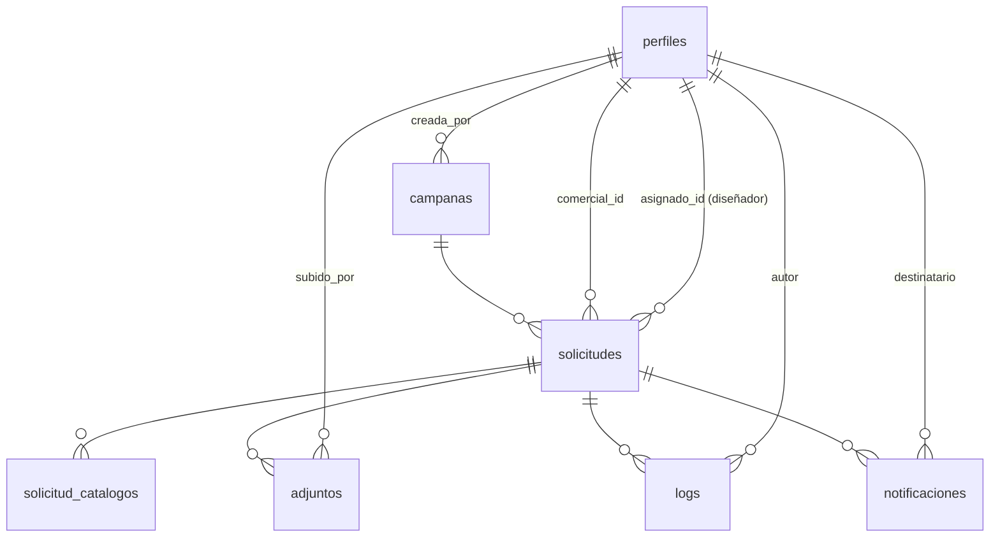

# 3. Modelo de datos

> Por el principio inamovible (`00-resumen-ejecutivo.md`), este documento describe el esquema **tal como existe hoy** en producción, con un único añadido: políticas RLS. No se introduce ningún tipo `enum`, tabla nueva ni columna nueva que no sea estrictamente necesaria para que Next.js pueda leer/escribir exactamente lo mismo que `index.html` lee/escribe hoy. Todo lo que en un diseño anterior de este documento proponía normalizar el esquema (roles, canal, documentos de campaña, lectura de notificaciones) se ha movido a `07-propuestas-futuras.md`.

## 3.1 Punto de partida: esto ya existe en producción

Antes de escribir la primera migración de la Fase 0 (método vigente — ver decisión de la Fase 0 de priorizar Dashboard sobre CLI, `00-resumen-ejecutivo.md` § "Principio de trabajo"):

1. Consultas de **solo lectura** en el **SQL Editor** del Dashboard del proyecto de producción (`paqtohmxagfebeyyurlq.supabase.co`) contra `information_schema` y `pg_policies` para obtener el esquema efectivo exacto: columnas y tipos reales, constraints existentes, y si ya hay alguna policy RLS parcial. Sin CLI, sin conexión directa a Postgres desde ninguna máquina — solo el navegador. (Se descartó explícitamente `supabase db pull`/`pg_dump`: exigían herramientas locales sin aportar ninguna garantía de seguridad adicional frente al SQL Editor para este caso.)
2. Aplicar ese mismo esquema (DDL) al **proyecto Supabase de desarrollo** (`portadas-personalizadas-dev`, Reference ID `xjyftgvyzyzmccobynzt`) pegando el SQL correspondiente en **su propio** SQL Editor. Todo lo que sigue en este documento (RLS, policies) se desarrolla y verifica contra ese proyecto de desarrollo, nunca directamente contra producción.
3. Confirmar contra el resultado de esas consultas los tipos de columna que aquí se describen como "a confirmar" (marcados explícitamente más abajo) — este documento se basa en el comportamiento observado en `index.html`, no en una inspección directa del esquema SQL.
4. Ninguna migración de esta fase hace `DROP TABLE`, `TRUNCATE`, ni renombra/retipa columnas con datos. Las únicas migraciones previstas son: `ALTER TABLE ... ENABLE ROW LEVEL SECURITY` y `CREATE POLICY`.
5. Estas migraciones se aplican contra el proyecto de **producción** únicamente como parte del Cutover (`06-roadmap.md`), pegadas en su SQL Editor, nunca antes — y solo tras haber sido validadas por completo contra el proyecto de desarrollo durante las Fases 0-5.
6. Cada SQL ejecutado en cualquiera de los dos SQL Editor se guarda también como archivo en `webapp/supabase/migrations/` (subido vía GitHub) para mantener el historial versionado en el repositorio — no depende de la CLI para existir, solo de copiar el SQL ya ejecutado.

## 3.2 Diagrama entidad-relación (sin cambios respecto al actual)



## 3.3 Qué cambia y qué no

| | Cambia en esta migración | No cambia (documentado en `07-propuestas-futuras.md` si aplica) |
|---|---|---|
| Permisos | Se eliminan las políticas `allow_all` existentes en las 7 tablas y se activan políticas reales replicando cada `if (rol === ...)` del JS actual (ver § 3.4.1 — RLS ya estaba "activada" pero neutralizada) | Qué ve cada rol — idéntico a hoy |
| Roles | — | `perfiles.rol` ya es un enum real (`rol_usuario`) en producción, con los mismos valores legacy documentados (`comercial_nacional`, `comercial_exportacion`, etc.) — no hay que crear el tipo, ya existe |
| Campañas | — | `covers`/`covers_instrucciones` siguen siendo JSON en la propia fila de `campanas` |
| Notificaciones | — | Sin columna `read_at`; estado de lectura sigue en `localStorage` del navegador |
| Logs | — | Sin `REVOKE UPDATE/DELETE` (aunque técnicamente no cambiaría comportamiento visible, no es estrictamente necesario para la migración — ver `07-propuestas-futuras.md` § 6 sobre el criterio usado) |
| Storage | — | Bucket `portadas-adjuntos` sigue con URLs públicas, sin políticas de acceso nuevas (pregunta abierta en `00-resumen-ejecutivo.md`) |

## 3.4 Tablas tal como existen — verificado contra producción el 2026-07-31

Esquema real, obtenido por consulta directa (SQL Editor, solo lectura) contra el proyecto de producción. Sustituye por completo la versión anterior de esta sección, que eran suposiciones basadas en `index.html` — varias resultaron incorrectas, ver el detalle marcado con **← real** en cada diferencia.

```sql
-- perfiles: "rol" ES un enum real (rol_usuario), no texto libre como se asumía.
-- Valores confirmados (10, coinciden exactamente con los documentados en 01-analisis-funcional.md):
--   admin, marketing, comercial, comercial_nacional, comercial_exportacion,
--   responsable, responsable_nacional, responsable_exportacion,
--   disenador, responsable_diseno
create table perfiles (
    id uuid primary key references auth.users(id),
    nombre text not null,
    email text not null,              -- ← real: SIN unique a nivel de BD (se asumía única)
    rol rol_usuario not null default 'comercial',  -- ← real: ENUM, no texto libre
    codigo text,                       -- ← real: nullable, SIN unique (se asumía not null)
    activo boolean not null default true,
    created_at timestamptz not null default now(),
    notif_preferencia text default 'ambas'  -- ← real: columna no documentada hasta ahora (ambas/email/herramienta/ninguna, ver NOT-11/NOT-12 de la matriz)
    -- sin columna "canal": el canal sigue incrustado en el valor de "rol", confirmado
);

create table campanas (
    id uuid primary key default uuid_generate_v4(),  -- ← real: uuid_generate_v4(), no gen_random_uuid()
    nombre text not null,
    descripcion text,
    fecha_cierre date,                 -- ← real: nullable (se asumía not null)
    activa boolean not null default true,
    created_at timestamptz not null default now(),
    catalogos jsonb default '["roly", "roly_wrk", "stamina"]'::jsonb,  -- ← real: JSONB, no array de texto; el default no incluye "xmas" (solo afecta a campañas nuevas sin especificar)
    covers jsonb default '{}'::jsonb,
    covers_instrucciones jsonb default '{}'::jsonb
    -- confirmado: NO existen updated_at ni creada_por
);

create table solicitudes (
    id uuid primary key default uuid_generate_v4(),
    campana_id uuid references campanas(id),      -- ← real: nullable (se asumía not null)
    comercial_id uuid references perfiles(id),      -- ← real: nullable (se asumía not null)
    asignado_id uuid references perfiles(id),
    cod_sap text not null,
    nombre_empresa text,                             -- ← real: nullable (se asumía not null)
    provincia text,
    estado estado_solicitud not null default 'borrador',  -- ← real: ENUM, no texto libre — ver hallazgo del valor "diseno_en_revision" más abajo
    comentarios text,
    created_at timestamptz not null default now(),
    updated_at timestamptz not null default now(),
    enviada_at timestamptz,
    confirmada_at timestamptz,          -- ← real: columna no documentada hasta ahora
    idioma text,                         -- ← real: nullable (se asumía not null)
    canal text                           -- ← real: nullable (se asumía not null)
    -- confirmado: NO existe constraint unique(campana_id, cod_sap) a nivel de BD —
    -- la comprobación de duplicados de SOL-11 es puramente del cliente (index.html), no de la base de datos
);

create table solicitud_catalogos (
    id uuid primary key default uuid_generate_v4(),
    solicitud_id uuid not null references solicitudes(id),
    catalogo text not null,
    catalogo_digital boolean,
    catalogo_impreso boolean,
    portada_personalizada boolean,
    portada_opcion_1 text,
    portada_opcion_2 text,
    portada_opcion_3 text,
    portada_diseno_propio boolean default false,
    posicion_logo text,
    unidades int,
    diseno_url text,        -- ← real: columna no documentada hasta ahora
    diseno_at timestamptz,  -- ← real: columna no documentada hasta ahora
    portada_elegida text,
    con_precios boolean,
    unique (solicitud_id, catalogo)  -- confirmado que existe, tal como se había documentado
);

create table adjuntos (
    id uuid primary key default uuid_generate_v4(),
    solicitud_id uuid not null references solicitudes(id),
    nombre text not null,
    tipo text not null,
    url text not null,
    subido_por uuid references perfiles(id),  -- ← real: nullable (se asumía not null)
    subido_por_nombre text,                    -- ← real: columna no documentada hasta ahora (snapshot del nombre)
    created_at timestamptz not null default now(),
    catalogo text
);

create table logs (
    id uuid primary key default uuid_generate_v4(),
    solicitud_id uuid references solicitudes(id),  -- ← real: nullable (se asumía not null)
    usuario_id uuid references perfiles(id),
    usuario_nombre text,
    accion text not null,
    detalle jsonb,
    created_at timestamptz not null default now()
);

create table notificaciones (
    id uuid primary key default uuid_generate_v4(),
    solicitud_id uuid references solicitudes(id),  -- ← real: nullable (se asumía not null)
    destinatario text not null,
    asunto text not null,
    cuerpo text not null,
    enviado boolean not null default false,
    enviado_at timestamptz,   -- ← real: columna no documentada hasta ahora
    created_at timestamptz not null default now()
    -- confirmado: sin read_at, el estado de lectura sigue en localStorage
);
```

Nota sobre `notificaciones.destinatario`: confirmado, sigue siendo un email en texto libre, no una FK a `perfiles`. Se mantiene así por lo mismo que ya se explicaba aquí: no es necesario para que RLS funcione, queda en `07-propuestas-futuras.md` si se decide limpiar.

### 3.4.1 Hallazgo crítico: RLS ya existe en producción — pero neutralizada

La premisa de partida de este documento ("hoy no hay RLS en producción, todo lo hace el JS") **era incorrecta en la forma técnica, aunque correcta en el efecto práctico**. La consulta real muestra:

- Las 7 tablas tienen `RLS habilitada` (`rowsecurity = true`).
- Cada una de las 7 tiene una política llamada `allow_all`: `USING (true)`, `WITH CHECK (true)`, aplicable a todos los comandos (`ALL`).
- `solicitudes` tiene además una segunda política, `comercial_solo_sus_solicitudes`, con una condición real y razonable (`rol <> 'comercial' OR comercial_id = auth.uid()`).

En PostgreSQL, las políticas permisivas (el tipo por defecto, y no hay ninguna marcada como `RESTRICTIVE` aquí) se combinan con **OR**. Como `allow_all` es literalmente `true`, el resultado de `true OR <cualquier otra condición>` es siempre `true` — **`comercial_solo_sus_solicitudes` no está teniendo ningún efecto real**, y las 7 tablas están, en la práctica, completamente abiertas a nivel de base de datos, igual que si RLS no existiera. Confirmado además que las políticas aplican al rol `public` (verificado por consulta adicional a `pg_policies.roles`) — es decir, esta apertura no se limita a usuarios autenticados: una petición con solo la clave anónima, sin ningún login, podría leer/escribir las 7 tablas igual. Esto confirma (por una vía distinta a la que asumíamos) que la única protección real hoy es la de `index.html` en el cliente.

**Consecuencia para `03-modelo-datos.md` § 3.5**: nuestra migración de RLS no puede limitarse a añadir políticas nuevas — tiene que **eliminar explícitamente las políticas `allow_all`** de las 7 tablas.

#### Comparación explícita: `comercial_solo_sus_solicitudes` (original) vs `solicitudes_select`/`solicitudes_update` (sustituta)

Se documenta este reemplazo con detalle, para que quede clara la decisión ante una futura auditoría — no es una sustitución "porque sí", hay una razón funcional concreta.

**Qué hacía la política original**, aislada (es decir, si `allow_all` no existiera):
```sql
using (((select rol from perfiles where id = auth.uid()) <> 'comercial'::rol_usuario) or (comercial_id = auth.uid()))
```
Es una política `FOR ALL` sin `WITH CHECK` propio (reutiliza el `USING` también para insert/update). Su lógica: *"si tu rol no es exactamente el valor de enum `comercial`, tienes acceso total; si lo es, solo a tus propias solicitudes."*

Aplicada rol por rol, sin `allow_all` al lado:

| Rol | Efecto de la política original, aislada | ¿Coincide con el comportamiento real de `index.html`? |
|---|---|---|
| `admin`, `marketing` | Acceso total | Sí |
| `comercial` (legado genérico) | Solo sus propias solicitudes | Sí |
| `responsable` (legado genérico) | Acceso total | Sin verificar (mismo TODO ya conocido, no cambia con este análisis) |
| `comercial_nacional`, `comercial_exportacion` | **Acceso total a las solicitudes de cualquier comercial** — ninguno de estos dos valores es literalmente igual a `'comercial'`, así que la condición los trata como "no comercial" | **No** — `index.html` sí les filtra "mis solicitudes" a `comercial_id = usuario actual`, igual que al legado `comercial` |
| `responsable_nacional`, `responsable_exportacion` | Acceso total a todos los canales, sin distinguir el propio | **No** — `index.html` los limita a los comerciales de su canal |
| `disenador`, `responsable_diseno` | Acceso total a solicitudes en cualquier estado | **No** — `index.html` solo muestra en la cola de diseño los estados `en_diseno`/`modificar_diseno`/`diseno_en_revision_comercial`/`confirmada` |

**Qué hace la política nueva**: reproduce, rol por rol, el mismo filtro que aplica hoy `index.html` (`renderComercialTable`, `renderDisenoTable`, el filtro de canal de `responsable_*`) — incluyendo a `comercial_nacional`/`comercial_exportacion`, que la original no distinguía del resto de roles.

**¿Se pierde algo?** No. Como ambas políticas están hoy neutralizadas por `allow_all` (esta misma sección), ningún usuario real ha experimentado nunca la restricción de la política original — lo único que decide el comportamiento hoy es el JS del cliente. La comparación que importa no es "original vs nueva", es "cada una vs el comportamiento real ya documentado en `01-analisis-funcional.md`/`09-matriz-paridad-funcional.md`": la nueva coincide con ese comportamiento para los 10 roles; la original, aislada, solo coincidía para 3 (`admin`, `marketing`, `comercial` legado) y habría sido **más permisiva de lo debido** para los otros 7 si alguna vez hubiera sido la única barrera activa. Sustituirla no quita ninguna restricción real existente — la sustituye por la única que coincide con la autoridad de comportamiento que de verdad existe en producción hoy: el JS del cliente.

**Corrección a la hipótesis inicial de esta sección**: la primera versión de este análisis especulaba que `comercial_solo_sus_solicitudes` "rompía el acceso de admin/marketing/diseño/responsables" y que `allow_all` se añadió como parche por eso. La tabla de arriba muestra que es al revés: esa política, aislada, no restringe a esos roles — les da acceso total. La hipótesis más plausible ahora es que se escribió cuando solo existía el rol genérico `comercial` (antes de introducirse las variantes `_nacional`/`_exportacion` documentadas en `01-analisis-funcional.md` § 1.3), y nunca se actualizó al añadirse esas variantes ni los roles de diseño — quedó desatendida por falta de mantenimiento, no por un conflicto activo que alguien tuviera que parchear. Se corrige aquí en vez de dejar la hipótesis original sin marcar, precisamente para que el historial del proyecto refleje el razonamiento correcto, no el primero que se nos ocurrió.

### 3.4.2 Resuelto: `diseno_en_revision` es un valor de enum sin uso

El enum `estado_solicitud` tiene 9 valores en vez de los 8 documentados hasta ahora, con uno adicional: `diseno_en_revision` (sin el sufijo `_comercial`). La base de datos de producción está vacía (se purgaron las solicitudes de prueba antes del lanzamiento), así que no se pudo verificar por datos — se verificó **leyendo el código de `index.html` directamente**, tal como pidió el usuario en vez de inferir de una base de datos sin filas:

- Ninguna asignación de estado en todo el archivo (`cambiarEstadoDirecto`, `marcarDisenoListo`, `enviarADiseno`, etc.) escribe el valor `diseno_en_revision` — todas usan `diseno_en_revision_comercial`.
- `ESTADO_LABEL` (línea 1657) no tiene entrada para `diseno_en_revision` — si apareciera, se mostraría el valor crudo sin traducir.
- `estadoOrder` (dashboard) y los datasets de gráficos tampoco lo incluyen.
- Solo hay un resto: una regla CSS (`.s-diseno_en_revision`, línea 156) que definiría el color de un badge si ese valor apareciera — pero como nada lo escribe nunca, no se llega a aplicar.

**Conclusión**: es un valor de enum inerte, casi con toda seguridad un resto de una versión anterior del esquema. No se incluye en ninguna política RLS ni en ningún flujo de la migración — no se puede eliminar de un enum de Postgres sin recrear el tipo, y no es necesario para la migración (principio inamovible: no tocar el esquema más de lo estrictamente necesario).

### 3.4.3 Resuelto: columnas existentes sin ningún uso en el cliente

Mismo método (lectura de `index.html`, no de datos) para las columnas que la base de datos vacía no podía confirmar:

- **`solicitudes.confirmada_at`, `solicitud_catalogos.diseno_url`, `solicitud_catalogos.diseno_at`**: cero referencias en todo `index.html`. Inertes — ninguna funcionalidad actual depende de ellas.
- **`notificaciones.enviado_at`** (y `enviado`): sí se escriben, en `enviarNotificacion` (~línea 5643), como `n.solo_herramienta ? true/now() : false/null`. Pero la función `push()` que construye cada notificación (~línea 5581) **nunca asigna `solo_herramienta`** — la condición es siempre falsa. En la práctica, `enviado` se guarda siempre como `false` y `enviado_at` siempre como `null`, para todas las notificaciones, siempre. Esto no es un hallazgo nuevo independiente: es la causa técnica exacta de H-03 (`09-matriz-paridad-funcional.md`, antes descrito de forma más genérica como "la preferencia de notificación no filtra el envío") — se amplía esa entrada con este detalle.

Ninguna de estas columnas se toca en la migración (se conservan, con su comportamiento inerte replicado tal cual) — cambiarlas sería una mejora funcional fuera de alcance, ver `07-propuestas-futuras.md`.

## 3.5 RLS objetivo — versión definitiva, reconciliada contra producción

RLS ya está habilitada en las 7 tablas (§ 3.4.1) — no hace falta `ALTER TABLE ... ENABLE ROW LEVEL SECURITY`, aunque se deja en el script por ser idempotente y no depender de ese hecho. El paso que sí es obligatorio y nuevo respecto a la versión anterior de esta sección es el `DROP POLICY allow_all` en cada tabla, **antes** de crear las políticas reales — si no, siguen sin tener ningún efecto (§ 3.4.1).

```sql
create or replace function rol_actual()
returns text  -- cast automático desde el enum rol_usuario (Postgres genera el cast de asignación al crear el tipo)
language sql stable security definer as $$
    select rol::text from perfiles where id = auth.uid()
$$;

create or replace function email_actual()
returns text
language sql stable security definer as $$
    select email from perfiles where id = auth.uid()
$$;
```

**Solicitudes** — se elimina `allow_all` y se sustituye `comercial_solo_sus_solicitudes` por una política equivalente pero completa (la original solo cubría el caso `comercial`; esta cubre también admin/marketing/responsables/diseño, que sin `allow_all` se habrían quedado sin acceso):

```sql
drop policy if exists allow_all on solicitudes;
drop policy if exists comercial_solo_sus_solicitudes on solicitudes;

create policy solicitudes_select on solicitudes for select
using (
    rol_actual() in ('admin', 'marketing')
    or comercial_id = auth.uid()
    or (rol_actual() = 'responsable_nacional' and canal = 'nacional')
    or (rol_actual() = 'responsable_exportacion' and canal = 'exportacion')
    or rol_actual() = 'responsable' -- legacy genérico: mismo comportamiento que hoy, a confirmar contra el código si ve todo o nada
    or (
        rol_actual() in ('disenador', 'responsable_diseno')
        and estado in ('en_diseno', 'modificar_diseno', 'diseno_en_revision_comercial', 'confirmada')
        -- NO se incluye 'diseno_en_revision' (sin sufijo): confirmado valor de enum inerte, ver § 3.4.2
    )
);

create policy solicitudes_insert on solicitudes for insert
with check (
    rol_actual() in ('admin', 'marketing', 'comercial_nacional', 'comercial_exportacion', 'comercial',
                      'responsable_nacional', 'responsable_exportacion', 'responsable')
);

create policy solicitudes_update on solicitudes for update
using (
    rol_actual() in ('admin', 'marketing')
    or comercial_id = auth.uid()
    or (rol_actual() = 'responsable_nacional' and canal = 'nacional')
    or (rol_actual() = 'responsable_exportacion' and canal = 'exportacion')
    or (rol_actual() in ('disenador', 'responsable_diseno') and estado in ('en_diseno', 'modificar_diseno'))
);

create policy solicitudes_delete on solicitudes for delete
using (
    rol_actual() in ('admin', 'marketing') -- admin/marketing: cualquier estado (eliminarSolicitud con rol=admin, y eliminarCampana que borra en cascada sin filtrar por estado — solo accesible desde la página de Campañas, admin/marketing)
    or (
        estado = 'borrador' -- el resto de roles solo puede borrar mientras esté en borrador (botón "Eliminar" de renderDetalle, línea 3365-3367), y solo si además pueden ver la fila
        and (
            comercial_id = auth.uid()
            or (rol_actual() = 'responsable_nacional' and canal = 'nacional')
            or (rol_actual() = 'responsable_exportacion' and canal = 'exportacion')
            or rol_actual() = 'responsable'
        )
    )
);
```

> **Nota de verificación obligatoria pendiente**: la condición para el rol legacy `responsable` (sin canal explícito) no se pudo determinar con certeza solo leyendo `index.html` — antes de activar esta policy en producción, verificar contra el código actual (o contra un usuario de prueba con ese rol) si ve todas las solicitudes, ninguna, o si ese valor de rol ya no está en uso.

**`solicitud_catalogos`, `adjuntos` y `logs`** heredan la visibilidad de su `solicitud_id`. **Corrección importante respecto a una versión anterior de esta sección**: `solicitud_catalogos` no puede tener una única política `FOR ALL` con la condición de `select` — eso permitiría borrar sus filas con solo poder *ver* la solicitud padre, sin exigir `borrador`/admin/marketing, replicando el mismo error de diseño que ya corregimos en `allow_all` (una política demasiado permisiva neutralizando la restricción real). Se separa en 4 políticas, una por comando:

```sql
drop policy if exists allow_all on solicitud_catalogos;

create policy solicitud_catalogos_select on solicitud_catalogos for select
using (exists (select 1 from solicitudes s where s.id = solicitud_catalogos.solicitud_id));

create policy solicitud_catalogos_insert on solicitud_catalogos for insert
with check (exists (select 1 from solicitudes s where s.id = solicitud_catalogos.solicitud_id));

create policy solicitud_catalogos_update on solicitud_catalogos for update
using (exists (select 1 from solicitudes s where s.id = solicitud_catalogos.solicitud_id));

create policy solicitud_catalogos_delete on solicitud_catalogos for delete
using (exists (
    select 1 from solicitudes s
    where s.id = solicitud_catalogos.solicitud_id
      and (s.estado = 'borrador' or rol_actual() in ('admin', 'marketing'))
));

drop policy if exists allow_all on adjuntos;
create policy adjuntos_select on adjuntos for select
using (exists (select 1 from solicitudes s where s.id = adjuntos.solicitud_id));
create policy adjuntos_insert on adjuntos for insert
with check (exists (select 1 from solicitudes s where s.id = adjuntos.solicitud_id));
create policy adjuntos_delete on adjuntos for delete
using (exists (
    select 1 from solicitudes s
    where s.id = adjuntos.solicitud_id
      and (s.estado = 'borrador' or rol_actual() in ('admin', 'marketing'))
));

drop policy if exists allow_all on logs;
create policy logs_select on logs for select
using (exists (select 1 from solicitudes s where s.id = logs.solicitud_id));
create policy logs_insert on logs for insert
with check (exists (select 1 from solicitudes s where s.id = logs.solicitud_id));
create policy logs_delete on logs for delete
using (exists (
    select 1 from solicitudes s
    where s.id = logs.solicitud_id
      and (s.estado = 'borrador' or rol_actual() in ('admin', 'marketing'))
));
```

**Notificaciones** — filtradas por email, igual que hoy; el `DELETE` se necesita porque `eliminarSolicitud`/`eliminarCampana` también borran las notificaciones de la solicitud:

```sql
drop policy if exists allow_all on notificaciones;

create policy notificaciones_select on notificaciones for select
using (destinatario = email_actual());

create policy notificaciones_update on notificaciones for update
using (destinatario = email_actual())
with check (destinatario = email_actual());

create policy notificaciones_delete on notificaciones for delete
using (exists (
    select 1 from solicitudes s
    where s.id = notificaciones.solicitud_id
      and (s.estado = 'borrador' or rol_actual() in ('admin', 'marketing'))
));
```

**Perfiles** — lectura abierta a cualquier autenticado (se necesita para asignar comerciales/diseñadores, menciones, etc., igual que hoy); escritura solo `admin`/`marketing` o el propio usuario sobre su fila. **Sin política de `DELETE`, a propósito**: confirmado por lectura de `index.html` que nunca se borra un usuario — `toggleUser` solo cambia `activo`, nunca hay un `.from('perfiles').delete()` en todo el archivo:

```sql
drop policy if exists allow_all on perfiles;

create policy perfiles_select on perfiles for select using (true);

create policy perfiles_update on perfiles for update
using (rol_actual() in ('admin', 'marketing') or id = auth.uid())
with check (rol_actual() in ('admin', 'marketing') or id = auth.uid());
```

**Campañas**: lectura abierta a cualquier autenticado (igual que hoy, todos necesitan ver campañas activas); escritura solo `admin`/`marketing` — `eliminarCampana` (línea 5076) solo es alcanzable desde la página de Campañas, que ya está restringida a estos dos roles:

```sql
drop policy if exists allow_all on campanas;

create policy campanas_select on campanas for select using (true);
create policy campanas_insert on campanas for insert with check (rol_actual() in ('admin', 'marketing'));
create policy campanas_update on campanas for update using (rol_actual() in ('admin', 'marketing'));
create policy campanas_delete on campanas for delete using (rol_actual() in ('admin', 'marketing'));
```

## 3.6 Storage

El bucket `portadas-adjuntos` mantiene sus URLs públicas actuales — no se añaden políticas de Storage en esta migración (pregunta abierta 2 de `00-resumen-ejecutivo.md`). Añadir RLS a las tablas de PostgreSQL no cambia nada sobre Storage: son sistemas de permisos independientes en Supabase.

## 3.7 Todo lo demás

Cualquier mejora de esquema identificada durante este diseño (roles normalizados, `read_at`, tabla de documentos de campaña, FK de notificaciones, políticas de Storage) está en `07-propuestas-futuras.md`, explícitamente fuera de esta migración.
