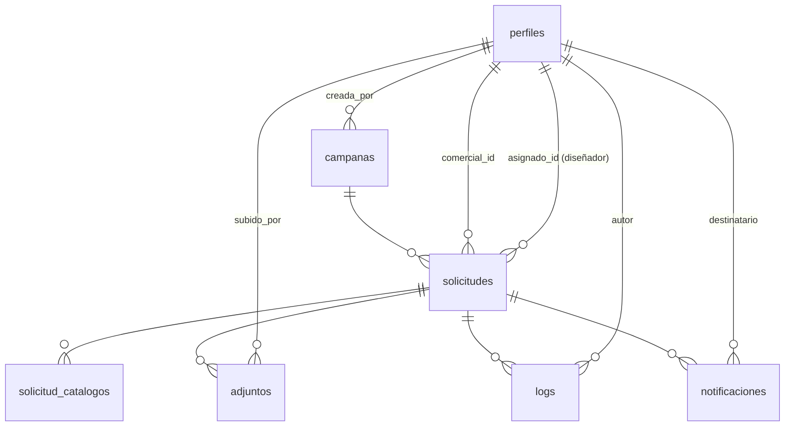

# 3. Modelo de datos

> Por el principio inamovible (`00-resumen-ejecutivo.md`), este documento describe el esquema **tal como existe hoy** en producción, con un único añadido: políticas RLS. No se introduce ningún tipo `enum`, tabla nueva ni columna nueva que no sea estrictamente necesaria para que Next.js pueda leer/escribir exactamente lo mismo que `index.html` lee/escribe hoy. Todo lo que en un diseño anterior de este documento proponía normalizar el esquema (roles, canal, documentos de campaña, lectura de notificaciones) se ha movido a `07-propuestas-futuras.md`.

## 3.1 Punto de partida: esto ya existe en producción

Antes de escribir la primera migración de la Fase 0:

1. `supabase db pull` contra el proyecto real (`paqtohmxagfebeyyurlq.supabase.co`) para obtener el esquema efectivo exacto: tipos de columna reales, constraints existentes, y si ya hay alguna policy RLS parcial.
2. Confirmar contra ese resultado los tipos de columna que aquí se describen como "a confirmar" (marcados explícitamente más abajo) — este documento se basa en el comportamiento observado en `index.html`, no en una inspección directa del esquema SQL.
3. Ninguna migración de esta fase hace `DROP TABLE`, `TRUNCATE`, ni renombra/retipa columnas con datos. Las únicas migraciones previstas son: `ALTER TABLE ... ENABLE ROW LEVEL SECURITY` y `CREATE POLICY`.

## 3.2 Diagrama entidad-relación (sin cambios respecto al actual)



## 3.3 Qué cambia y qué no

| | Cambia en esta migración | No cambia (documentado en `07-propuestas-futuras.md` si aplica) |
|---|---|---|
| Permisos | Se activa RLS en PostgreSQL replicando cada `if (rol === ...)` del JS actual | Qué ve cada rol — idéntico a hoy |
| Roles | — | `perfiles.rol` sigue siendo texto libre con los valores legacy (`comercial_nacional`, `comercial_exportacion`, etc.) |
| Campañas | — | `covers`/`covers_instrucciones` siguen siendo JSON en la propia fila de `campanas` |
| Notificaciones | — | Sin columna `read_at`; estado de lectura sigue en `localStorage` del navegador |
| Logs | — | Sin `REVOKE UPDATE/DELETE` (aunque técnicamente no cambiaría comportamiento visible, no es estrictamente necesario para la migración — ver `07-propuestas-futuras.md` § 6 sobre el criterio usado) |
| Storage | — | Bucket `portadas-adjuntos` sigue con URLs públicas, sin políticas de acceso nuevas (pregunta abierta en `00-resumen-ejecutivo.md`) |

## 3.4 Tablas tal como existen (a confirmar con `db pull`)

```sql
-- perfiles: rol es texto libre, no enum. Valores observados en index.html:
--   admin, marketing, comercial_nacional, comercial_exportacion, comercial,
--   responsable_nacional, responsable_exportacion, responsable,
--   disenador, responsable_diseno
create table perfiles (
    id uuid primary key references auth.users(id), -- a confirmar: on delete cascade/set null
    nombre text not null,
    email text not null,
    codigo text not null,
    rol text not null,
    activo boolean not null default true,
    created_at timestamptz -- a confirmar si existe
    -- sin columna "canal": el canal está incrustado en el valor de "rol"
);

create table campanas (
    id uuid primary key default gen_random_uuid(),
    nombre text not null,
    descripcion text,
    fecha_cierre date not null,
    activa boolean not null default true,
    catalogos text[] not null default '{}', -- a confirmar tipo exacto (array vs jsonb)
    covers jsonb not null default '{}',              -- {catalogo_key: url_pdf}
    covers_instrucciones jsonb not null default '{}' -- {catalogo_key: url_pdf}
    -- a confirmar: created_at/updated_at/creada_por
);

create table solicitudes (
    id uuid primary key default gen_random_uuid(),
    campana_id uuid not null references campanas(id),
    comercial_id uuid not null references perfiles(id),
    asignado_id uuid references perfiles(id), -- diseñador asignado, null = sin autoasignar
    canal text not null, -- 'nacional' | 'exportacion' — dato de la solicitud, independiente del texto libre del rol
    idioma text not null,
    cod_sap text not null,
    nombre_empresa text not null,
    provincia text,
    comentarios text,
    estado text not null default 'borrador', -- texto libre, no enum: borrador/enviada/en_revision_marketing/
                                              -- en_diseno/modificar_diseno/diseno_en_revision_comercial/
                                              -- confirmada/archivada
    enviada_at timestamptz,
    created_at timestamptz,
    updated_at timestamptz
    -- a confirmar: constraint unique(campana_id, cod_sap) — verificar si ya existe o solo se valida en el cliente
);

create table solicitud_catalogos (
    id uuid primary key default gen_random_uuid(),
    solicitud_id uuid not null references solicitudes(id),
    catalogo text not null, -- roly | roly_wrk | stamina | xmas
    catalogo_digital boolean,
    catalogo_impreso boolean,
    portada_personalizada boolean,
    portada_diseno_propio boolean,
    con_precios boolean,
    portada_opcion_1 text,
    portada_opcion_2 text,
    portada_opcion_3 text,
    posicion_logo text, -- 'A' | 'B' | 'C'
    unidades int,
    portada_elegida text
);

create table adjuntos (
    id uuid primary key default gen_random_uuid(),
    solicitud_id uuid not null references solicitudes(id),
    catalogo text, -- null si es el logo general
    tipo text not null, -- logo_general | stamina_diseno | diseno_portada | modificacion | ...
    nombre text,
    url text not null, -- URL pública de Storage
    subido_por uuid references perfiles(id),
    subido_por_nombre text
);

create table logs (
    id uuid primary key default gen_random_uuid(),
    solicitud_id uuid not null references solicitudes(id),
    usuario_id uuid references perfiles(id),
    usuario_nombre text,
    accion text not null, -- creacion | edicion | adjunto | asignacion | comentario | cambio_estado
    detalle jsonb,
    created_at timestamptz
);

create table notificaciones (
    id uuid primary key default gen_random_uuid(),
    solicitud_id uuid not null references solicitudes(id),
    destinatario text not null, -- email, no uuid — a confirmar si conviene un FK o se mantiene como email suelto
    asunto text not null,
    cuerpo text not null,
    enviado boolean not null default false,
    created_at timestamptz
    -- sin read_at: el estado de lectura vive en localStorage del navegador (portadas_notifs_read)
);
```

Nota sobre `notificaciones.destinatario`: hoy es un email en texto libre, no una FK a `perfiles`. Esto se mantiene así — cambiarlo a `destinatario_id uuid references perfiles(id)` sería más correcto relacionalmente, pero no es necesario para que RLS funcione (se puede filtrar por `destinatario = (select email from perfiles where id = auth.uid())`) y por tanto no es "estrictamente necesario"; queda en `07-propuestas-futuras.md` si en algún momento se decide limpiar.

## 3.5 RLS objetivo — contra el esquema exactamente como es

```sql
create or replace function rol_actual()
returns text
language sql stable security definer as $$
    select rol from perfiles where id = auth.uid()
$$;

create or replace function email_actual()
returns text
language sql stable security definer as $$
    select email from perfiles where id = auth.uid()
$$;
```

**Solicitudes** — cada condición es literalmente la misma que hoy decide una fila visible en `renderComercialTable`/`renderDisenoTable`, incluidas las variantes legacy de rol:

```sql
alter table solicitudes enable row level security;

create policy solicitudes_select on solicitudes for select
using (
    rol_actual() in ('admin', 'marketing')
    or comercial_id = auth.uid()
    or (rol_actual() = 'responsable_nacional' and canal = 'nacional')
    or (rol_actual() = 'responsable_exportacion' and canal = 'exportacion')
    or rol_actual() = 'responsable' -- legacy genérico: mismo comportamiento que hoy, a confirmar contra el código si ve todo o nada
    or (
        rol_actual() in ('disenador', 'responsable_diseno')
        and estado in ('en_diseno', 'modificar_diseno', 'diseno_en_revision_comercial', 'confirmada')
    )
);

create policy solicitudes_insert on solicitudes for insert
with check (
    rol_actual() in ('admin', 'marketing', 'comercial_nacional', 'comercial_exportacion', 'comercial',
                      'responsable_nacional', 'responsable_exportacion', 'responsable')
);

create policy solicitudes_update on solicitudes for update
using (
    rol_actual() in ('admin', 'marketing')
    or comercial_id = auth.uid()
    or (rol_actual() = 'responsable_nacional' and canal = 'nacional')
    or (rol_actual() = 'responsable_exportacion' and canal = 'exportacion')
    or (rol_actual() in ('disenador', 'responsable_diseno') and estado in ('en_diseno', 'modificar_diseno'))
);
```

> **Nota de verificación obligatoria**: la condición para el rol legacy `responsable` (sin canal explícito) no se pudo determinar con certeza solo leyendo `index.html` — antes de activar esta policy en producción, verificar contra el código actual (o contra un usuario de prueba con ese rol) si ve todas las solicitudes, ninguna, o si ese valor de rol ya no está en uso. Esto es exactamente el tipo de comprobación que exige el principio de paridad: no se puede "decidir" el comportamiento de un rol legacy, hay que confirmarlo.

`solicitud_catalogos`, `adjuntos` y `logs` heredan la visibilidad de su `solicitud_id` con el mismo patrón (`exists (select 1 from solicitudes s where s.id = solicitud_id and <condición de arriba>)`).

**Notificaciones** — filtradas por email, igual que hoy:

```sql
alter table notificaciones enable row level security;

create policy notificaciones_select on notificaciones for select
using (destinatario = email_actual());
```

**Campañas y usuarios**: lectura abierta a cualquier autenticado (igual que hoy, todos necesitan ver campañas activas); escritura solo `admin`/`marketing`:

```sql
alter table campanas enable row level security;
create policy campanas_select on campanas for select using (true);
create policy campanas_write on campanas for insert with check (rol_actual() in ('admin', 'marketing'));
create policy campanas_update on campanas for update using (rol_actual() in ('admin', 'marketing'));
```

## 3.6 Storage

El bucket `portadas-adjuntos` mantiene sus URLs públicas actuales — no se añaden políticas de Storage en esta migración (pregunta abierta 2 de `00-resumen-ejecutivo.md`). Añadir RLS a las tablas de PostgreSQL no cambia nada sobre Storage: son sistemas de permisos independientes en Supabase.

## 3.7 Todo lo demás

Cualquier mejora de esquema identificada durante este diseño (roles normalizados, `read_at`, tabla de documentos de campaña, FK de notificaciones, políticas de Storage) está en `07-propuestas-futuras.md`, explícitamente fuera de esta migración.
