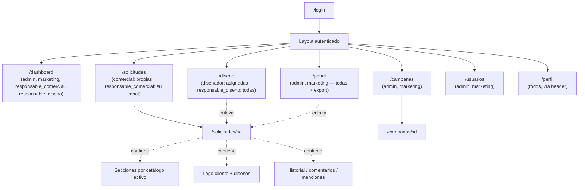
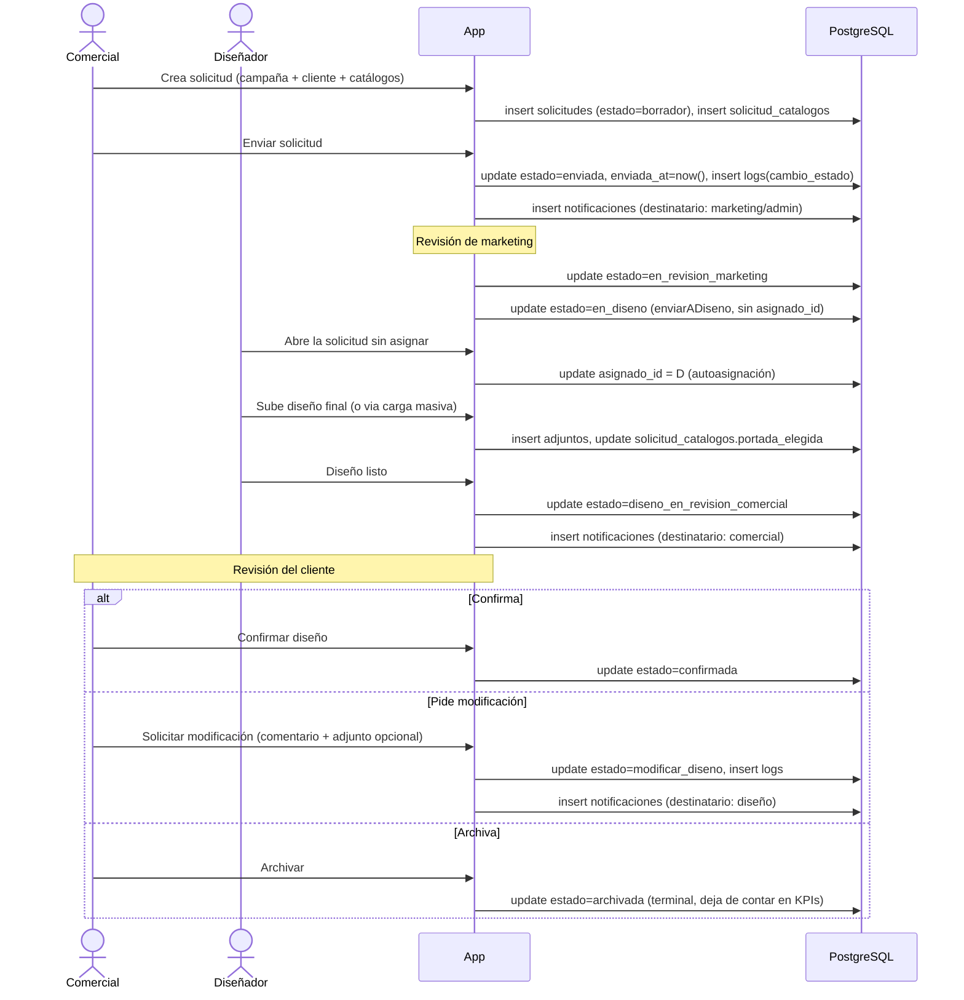
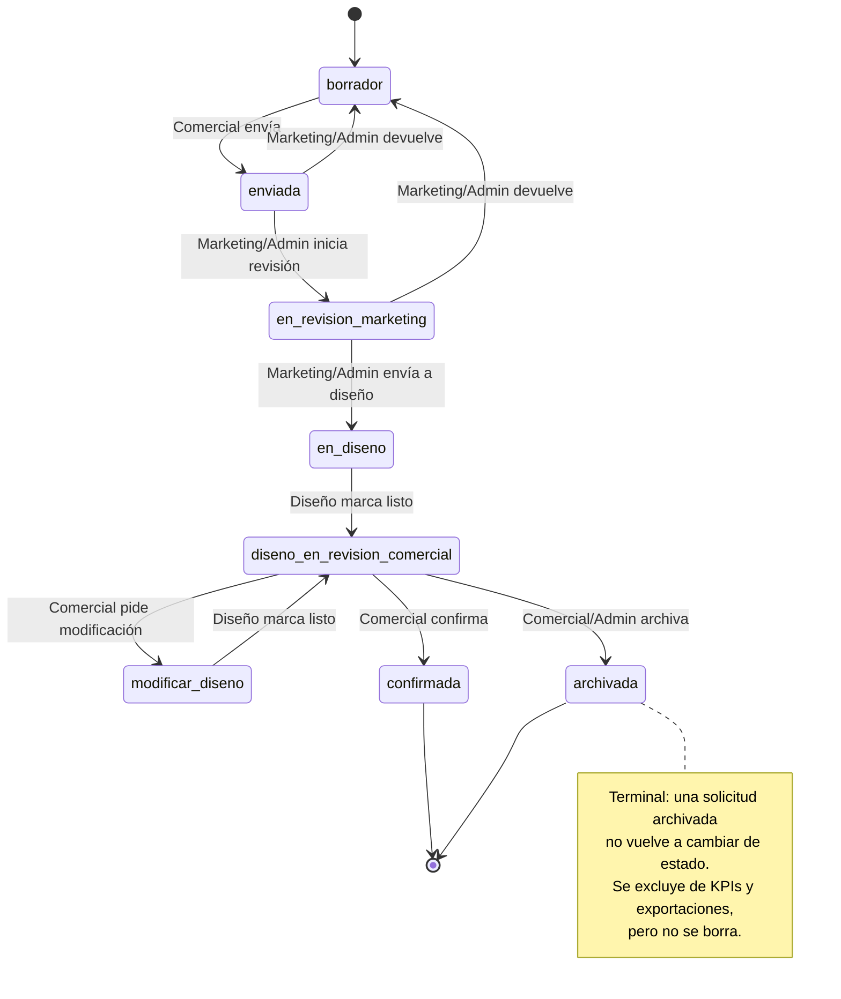
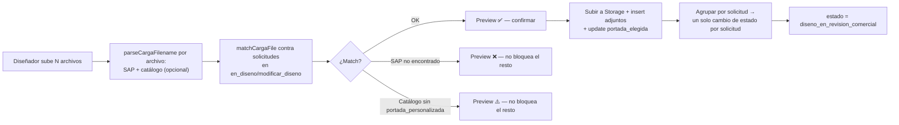
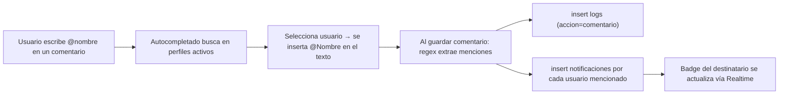

# 5. Flujo de navegación

## 5.1 Sitemap

Cada rol solo ve en el nav las páginas para las que tiene permiso (ver tabla de la sección 1.4 de `01-analisis-funcional.md`); esto es la misma restricción que hoy aplica `buildNav()`, pero reforzada por RLS en cada consulta subyacente, no solo en qué enlaces se pintan.

## 5.2 Flujo crítico: ciclo de vida de una solicitud

## 5.3 Máquina de estados de una solicitud

Cada flecha de este diagrama es una Server Action distinta (`enviarADiseno`, `marcarDisenoListo`, `confirmarDiseno`, `solicitarModificacion`, `archivarSolicitud`...), nunca un `UPDATE estado = ...` genérico — así la validación de "quién puede hacer esta transición" vive en un solo sitio por transición, no repartida en un `switch` grande.

## 5.4 Flujo: carga masiva de diseños

Este flujo se mantiene exactamente igual que hoy (es como el equipo de diseño ya trabaja) — lo que cambia es que `matchCargaFile` consulta contra RLS igual que cualquier otra lectura, y la actualización final pasa por la misma Server Action `marcarDisenoListo` que se usaría subiendo un archivo individual, evitando lógica duplicada entre los dos caminos.

## 5.5 Flujo: notificación por mención

